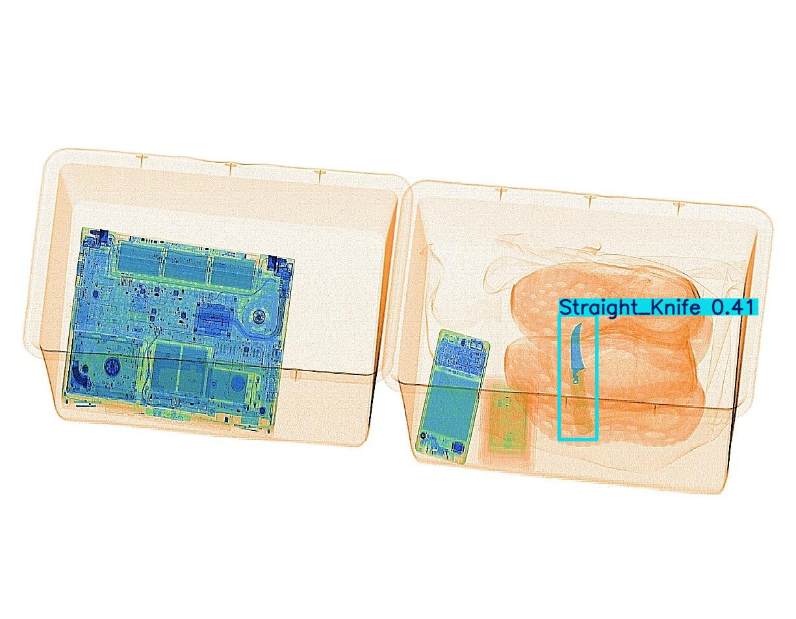

# Airport Security Object Detection — YOLOv8

A computer vision system that detects concealed weapons in airport X-ray baggage scans using a fine-tuned YOLOv8n model. Includes a desktop GUI for running live inference.

---

## Demo



---

## Features

- Detects 5 classes of prohibited items from X-ray imagery
- Trained on the [OPIXray dataset](https://github.com/OPIXray-author/OPIXray)
- Desktop UI built with Tkinter for drag-and-drop inference
- Real-time threat/clear verdict with confidence scores and bounding box coordinates
- Save annotated result images directly from the UI

---

## Detected Classes

| ID | Class |
|----|-------|
| 0 | Folding Knife |
| 1 | Straight Knife |
| 2 | Scissor |
| 3 | Utility Knife |
| 4 | Multi-tool Knife |

---

## Model Performance

| Metric | Value |
|--------|-------|
| mAP@0.5 | 83.9% |
| Epochs | 10 |
| Image size | 640px |
| Batch size | 16 |
| Architecture | YOLOv8n |

---

## Project Structure

```
airport-security-detection/
├── ui/
│   └── airport_security_ui.py   # Desktop inference UI
├── config/
│   └── data.yaml                # Dataset class definitions
├── predictions/
│   ├── prediction1.jpg          # Sample prediction output
│   └── prediction2.jpg
├── results/
│   ├── results.png              # Training curves
│   ├── confusion_matrix.png
│   └── BoxPR_curve.png
├── requirements.txt
└── README.md
```

> **Note:** The trained model weights (`best.pt`) are not included in this repo due to file size.  
> Download them from the [Releases](../../releases) page and place in `ui/` before running.

---

## Getting Started

### 1. Clone the repo

```bash
git clone https://github.com/GeorgiosTsipis/airport-security-detection.git
cd airport-security-detection
```

### 2. Install dependencies

```bash
pip install -r requirements.txt
```

### 3. Download model weights

Download `best.pt` from the [Releases](../../releases) page and place it in `ui/`.

### 4. Run the UI

```bash
python ui/airport_security_ui.py
```

---

## Training

The model was trained on Google Colab using the OPIXray dataset formatted for YOLOv8.

```python
from ultralytics import YOLO

model = YOLO("yolov8n.pt")
model.train(
    data="config/data.yaml",
    epochs=10,
    imgsz=640,
    batch=16,
    project="runs/opixray_yolov8"
)
```

---

## Requirements

```
ultralytics==8.0.196
torch>=2.0.0
pillow>=9.5.0
opencv-python>=4.7.0
numpy>=1.24.0
```

---

## License

MIT
